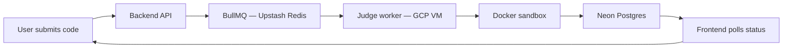
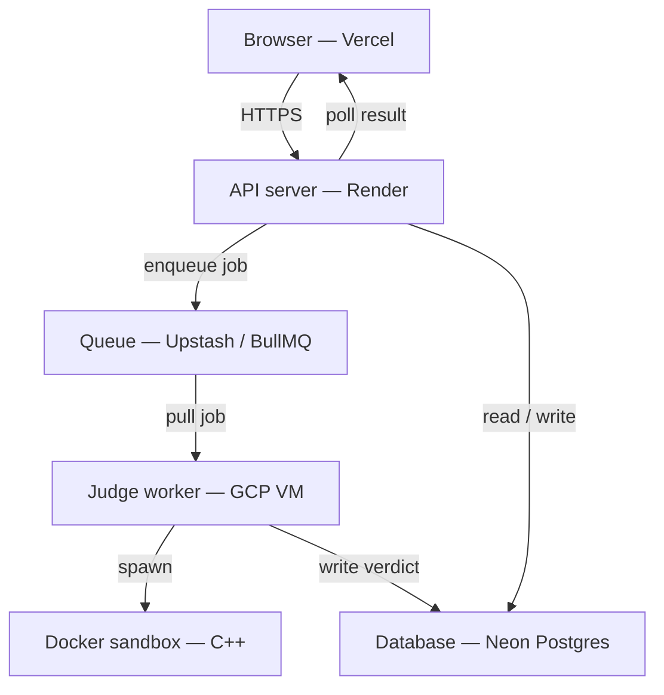

# CodeDaily

A DSA practice platform where code submissions are queued, executed in isolated Docker containers on a dedicated judge worker, and results are polled back to the UI asynchronously.

---

## How It Works



### Submission flow

1. Frontend sends `POST /api/v1/submission` or `POST /api/v1/submission/run`
2. Backend validates the payload and creates a `Submission` record with `Pending` verdict
3. Job is pushed to BullMQ (`submission-queue` or `run-code-queue`)
4. Judge worker picks up the job, compiles the code, and runs test cases inside Docker with resource limits (no network, CPU/memory caps, seccomp profile, timeout)
5. Worker writes the verdict, execution time, and memory usage back to Postgres
6. Frontend polls `GET /api/v1/submission/:id/status` every second until verdict is terminal

---

## Tech Stack

| Layer | Technologies |
|---|---|
| Frontend | React 19, Vite, React Router, Monaco Editor, Tailwind CSS v4, shadcn/ui, Zustand, Axios |
| Backend | Node.js, Express, Better Auth, Prisma, Zod |
| Infrastructure | Vercel · Render · GCP VM · Upstash Redis · Neon Postgres · Docker |

## Infrastructure



---

---

## Architecture

**API server** handles auth, problems, submissions, leaderboard, and profile. It never runs user code — it enqueues jobs and returns immediately, keeping request latency stable regardless of execution load.

**Queue layer (BullMQ + Upstash Redis)** decouples submission rate from execution capacity. Bursts are absorbed by the queue rather than dropped or timed out. Failed jobs can be retried without touching the API layer.

**Judge worker (GCP VM)** runs as a separate always-on process that consumes from both queues. Keeping it on a dedicated VM means the judging path has no cold starts, and if the worker crashes or restarts it doesn't affect auth or the API.

**Docker sandbox** compiles and runs C++ inside a constrained container with hard limits: no network access, CPU and memory caps, process limits, dropped Linux capabilities, seccomp filtering, and a wall-clock timeout. User code cannot affect the host.

**Data layer (Neon Postgres + Prisma)** stores users, problems, test cases, submissions, discussions, and solutions. The worker writes results directly; the API reads them back on each poll.

---

## Features

- Email/password and OAuth auth via Better Auth
- Problem catalog with difficulty levels and search
- Monaco-based editor with run and submit flows
- Verdicts: accepted, wrong answer, compilation error, runtime error, TLE, MLE
- Execution time and memory surfaced per submission
- Per-problem leaderboard sorted by execution time
- Profile with submission history and solved-by-difficulty breakdown
- Community discussions and solution posts (gated until problem is attempted)
- Admin problem creation with hidden and visible test cases

---

## Local Development

### Prerequisites

- Node.js 20+
- Docker
- A Postgres database
- A Redis instance

### Setup

```bash
git clone <repo-url>
cd codeDaily

cd backend && npm install
cd ../frontend && npm install
```

`backend/.env`:

```env
PORT=10000
FRONTEND_URL=http://localhost:5173

DATABASE_URL=<pooled_postgres_url>
DATABASE_URL_UNPOOLED=<direct_postgres_url>

BETTER_AUTH_SECRET=<secret>
BETTER_AUTH_URL=http://localhost:10000

GOOGLE_CLIENT_ID=
GOOGLE_CLIENT_SECRET=
GITHUB_CLIENT_ID=
GITHUB_CLIENT_SECRET=

REDIS_URL=<redis_url>
```

`frontend/.env`:

```env
VITE_API_URL=http://localhost:10000
```

```bash
cd backend
npx prisma generate
npx prisma db push

# Build the judge image
docker build -t codedaily-runner ./docker/coderunner
```

Start all three in separate terminals:

```bash
cd backend && npm run dev          # API
cd backend && npm run dev:worker   # Judge worker
cd frontend && npm run dev         # Frontend
```

---

## Design Decisions

**Queue-based judging** — submissions go to BullMQ rather than being executed inline. This keeps API response times predictable and means a slow or hostile submission can't block other users. The tradeoff is polling complexity and eventual consistency on the result.

**Separate worker tier** — the judge runs on its own always-on VM rather than on the API host. If judging needs a restart, auth and the API stay up. The tradeoff is the ops overhead of managing a separate process and VM.

**Docker over direct execution** — user code runs inside a container with strict resource limits rather than as a bare process. The tradeoff is container startup overhead on each submission.

**Polling over WebSockets** — the frontend polls for results rather than holding open a socket. It's simpler to operate behind managed hosting layers and requires no persistent server-side connection state. The tradeoff is slightly delayed result delivery and periodic status requests.

**C++ only for now** — the judge supports one language to ship the core execution pipeline cleanly. Adding more languages reuses the same queue, worker, and sandbox with per-language runner images.

---

## What's Next

- Multi-language support via per-language runner images
- WebSocket or SSE result delivery to replace polling
- Structured logging and per-verdict metrics on the worker
- Worker autoscaling based on queue depth
